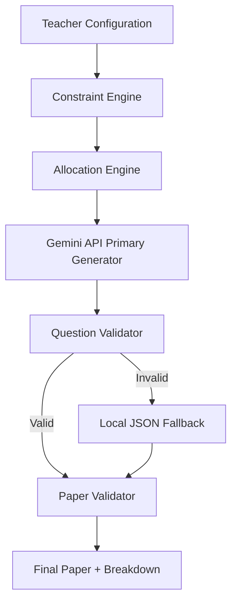

# Smart Question Paper Generator

## Overview
The **Smart Question Paper Generator** is a tool built for Evalvia.AI to help teachers rapidly generate constraints-compliant, realistic assessment papers. Unlike naive AI generators, this system relies on a **Deterministic Allocation Engine** to parse structural constraints and handle conflicts gracefully before using AI for semantic question text generation.

## Problem
Teachers often spend hours manually balancing paper constraints (Total Marks, Topic Distributions, Difficulty, Question Types) alongside sourcing adequate questions. Standard LLM prompts fail because language models are notoriously poor at rigid numerical and percentage constraints (e.g. generating exactly 40 marks across 3 different topics with a 30-50-20 difficulty split).

# 📸 Screenshots
## 🏠 Landing Page
## 🏠 Demo Question Paper
## 🏠 Constraint Adjustment


## 🏠 Question Bank


## Features
- 📊 **Deterministic Constraint Validation**: Translates desired percentages into integer marks using the largest remainder method.
- ⚙️ **Allocation Engine**: Groups requirements into specific "slots" before any question text is generated, allowing early conflict detection.
- ⚠️ **Graceful Conflict Handling**: Instead of failing or silently drifting from constraints, the engine will explicitly report what had to be adjusted and why.
- 🤖 **Hybrid Generation Approach**: Uses deterministic logic for the math, and Gemini AI for generating the actual semantic questions to fit the allocation slots.
- 🔁 **Single Question Regeneration**: Allows a teacher to regenerate a single question perfectly preserving its constraints (topic, type, difficulty, marks) without affecting the overall paper layout.
- fallback **Robust Fallback Mechanism**: Includes a local JSON Question Bank used as a deterministic fallback if the AI model times out or generates invalid outputs.

## Architecture & Why Hybrid AI + Deterministic Logic

We chose a **Hybrid Architecture** because deterministic logic is best suited for structural and numerical guarantees (like total marks and exact percentages), whereas AI is unmatched in generating varied, semantically accurate textual questions.

## Constraint Handling & Rounding Strategy
The system processes percentages into target marks. Because a requirement like "33% of 40 marks" yields 13.2 marks, the engine first floors all values to whole integers, then uses a "largest remainder" distribution to assign the remaining marks, guaranteeing the sum perfectly equals the requested `totalMarks`.
If the requested configurations are completely impossible (e.g., requesting 10 marks of hard questions but having no hard templates/slots), the Allocation engine computes the closest viable structure and returns detailed deviation messages in the payload.

## Setup & Running Locally

1. **Prerequisites**: Node.js v18+ 
2. **Environment**: 
   - Duplicate `backend/.env.example` to `backend/.env`
   - Insert your `GEMINI_API_KEY`
3. **Running the Backend**:
   ```bash
   cd backend
   npm install
   npm run dev
   ```
4. **Running the Frontend**:
   ```bash
   cd frontend
   npm install
   npm run dev
   ```

## Known Limitations & Weaknesses
- **Local Fallback Pool**: The fallback JSON bank currently contains only a handful of hardcoded math examples. If Gemini fails entirely, you will likely encounter repeated questions for specific permutations.
- **Strict Validations**: The AI prompt is very strict on formatting, which can sometimes lead to generation errors.

## What I'm Proud Of
- The **Allocation Engine** successfully bridges the gap between high-level user percentages and concrete, AI-ready generation slots while minimizing rounding errors.
- The **Single Question Regeneration** feature which isolates the generation to a specific slot ID and re-validates the overall paper instantly, providing massive QoL to teachers.
